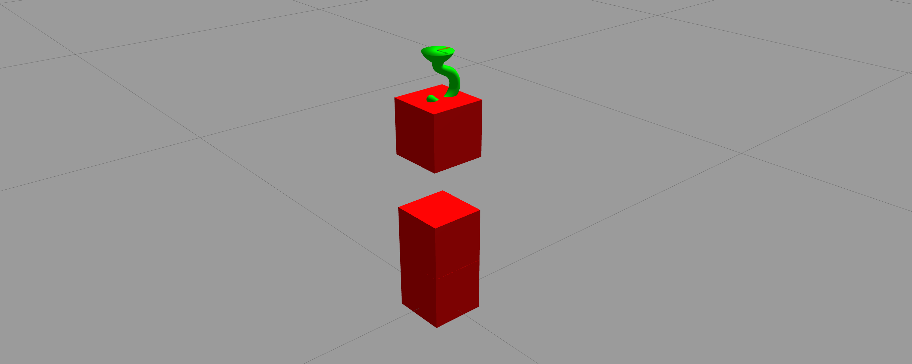

## Hook gripper for [classic]-gazebo

The gripper implemented as gazebo model plugin.
The intuition of the logic of the package is following:

- get collide gripper and grasp object links
- creates fixed joint between these links
- to attach/detach using ROS-service
- to feedback about ready-to-attach and attaching-state used ROS-topics

## How to install

    git clone https://github.com/kirillin/hook_gripper_gazebo.git
    catkin build

## How to test-use it

Start test gripper world

    roslaunch hook_gripper_gazebo test_gripper.launch

Control simple 1-dof using

    rosrun rqt_joint_trajectory_controller rqt_joint_trajectory_controller

To get feedback data

    rostopic echo /gripper/state
    rostopic echo /gripper/ready

To grasp object

    rosservice call /gripper/grasp {data: true}

To release object

    rosservice call /gripper/grasp {data: false}

## License

MIT License